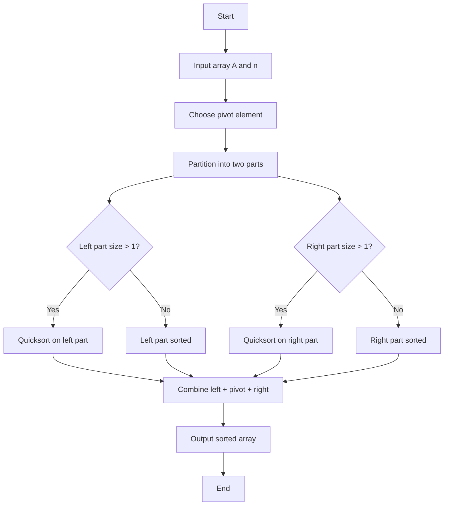

[README.md](https://github.com/user-attachments/files/33116612/README.md)
# 📘 Design and Analysis of Algorithms (DAA)


> “Algorithms are the language of problem solving.”


This repository contains C implementations of classic algorithms from my **Design and Analysis of Algorithms** coursework and personal practice. Each program is written to be simple and readable, and the table below summarises the technique and complexity of each one.

---

## 📑 Table of Contents

- [Algorithms Implemented](#-algorithms-implemented)
- [Repository Structure](#-repository-structure)
- [How to Compile and Run](#-how-to-compile-and-run)
- [Quicksort Flowchart](#-quicksort-flowchart)
- [Concepts Covered](#-concepts-covered)
- [Author](#-author)

---

## 🚀 Algorithms Implemented

### Divide and Conquer
| Algorithm | File | Time Complexity | Space |
|---|---|---|---|
| Quick Sort | [`Quik_sort.c`](Quik_sort.c) | Best/Avg: O(n log n), Worst: O(n²) | O(log n) avg |
| Merge Sort | [`merge_sort.c`](merge_sort.c) | O(n log n) in all cases | O(n) |
| Matrix Multiplication | [`Matrix Multiplication.c`](Matrix%20Multiplication.c) | O(m·n·p) | O(m·p) |

### Greedy Method
| Algorithm | File | Time Complexity |
|---|---|---|
| Prim's MST | [`Minimum_Spanning _Tree _ using _prim's _algorithm.c`](Minimum_Spanning%20_Tree%20_%20using%20_prim's%20_algorithm.c) | O(V²) |
| Kruskal's MST | [`Minimum_Spanning _Tree _ using _Kruskal’s _algorithm.c`](Minimum_Spanning%20_Tree%20_%20using%20_Kruskal%E2%80%99s%20_algorithm.c) | O(E log E) with sorting; O(V²) in simple form |
| Dijkstra's Shortest Path | [`Dijkstra's Shortest Path Algorithm.c`](Dijkstra's%20Shortest%20Path%20Algorithm.c) | O(V²) |

### Dynamic Programming
| Algorithm | File | Time Complexity |
|---|---|---|
| 0/1 Knapsack | [`Knapsack Problem.c`](Knapsack%20Problem.c) | O(N·W) |
| Longest Common Subsequence (3 strings) | [`Longest Common Sub Sequence.c`](Longest%20Common%20Sub%20Sequence.c) | O(m·n·o) |
| Bellman-Ford (single-source shortest path, negative edges) | [`Bellman-Ford algorithm.c`](Bellman-Ford%20algorithm.c) | O(V·E) |
| Travelling Salesman Problem (bitmask DP) | [`Travelling Salesman Problem.c`](Travelling%20Salesman%20Problem.c) | O(n²·2ⁿ) |

### Graph Traversal
| Algorithm | File | Time Complexity |
|---|---|---|
| Breadth First Search (BFS) | [`Breadth First Search (BFS).c`](Breadth%20First%20Search%20(BFS).c) | O(V + E) |
| Depth First Search (DFS) | [`Depth-First Search (DFS).c`](Depth-First%20Search%20(DFS).c) | O(V + E) |

### Backtracking
| Algorithm | File | Time Complexity |
|---|---|---|
| Sum of Subsets | [`Implement sum of subset problem using Backtracking.c`](Implement%20sum%20of%20subset%20problem%20using%20Backtracking.c) | O(2ⁿ) |

---

## 📂 Repository Structure

```
Design-and-Analysis-of-Algorithm-/
├── Quik_sort.c
├── merge_sort.c
├── Matrix Multiplication.c
├── Knapsack Problem.c
├── Longest Common Sub Sequence.c
├── Travelling Salesman Problem.c
├── Bellman-Ford algorithm.c
├── Dijkstra's Shortest Path Algorithm.c
├── Minimum_Spanning _Tree _ using _prim's _algorithm.c
├── Minimum_Spanning _Tree _ using _Kruskal’s _algorithm.c
├── Breadth First Search (BFS).c
├── Depth-First Search (DFS).c
├── Implement sum of subset problem using Backtracking.c
└── README.md
```

---

## ⚙️ How to Compile and Run

You need a C compiler such as **GCC**.

```bash
# Clone the repository
git clone https://github.com/Rajeshwari-Bhute/Design-and-Analysis-of-Algorithm-.git
cd Design-and-Analysis-of-Algorithm-

# Compile (quote file names that contain spaces)
gcc "Quik_sort.c" -o quicksort

# Run
./quicksort          # Linux / macOS
quicksort.exe        # Windows
```

Most programs read their input from the keyboard (e.g. number of elements, then the elements), so just follow the prompts in the terminal.

---

## 🧠 Quicksort Flowchart



**How Quicksort works:** it picks a *pivot*, partitions the array into elements smaller and larger than the pivot, then recursively sorts each part.
Worst case O(n²) happens when pivot selection is poor (e.g. an already sorted array with the last element as pivot).

---

## 📚 Concepts Covered

- Divide and Conquer
- Greedy Algorithms
- Dynamic Programming
- Graph Algorithms (traversal, shortest path, spanning trees)
- Backtracking
- Time and Space Complexity Analysis (Big-O)

---

## 👩‍💻 Author

**Rajeshwari Bhute**
GitHub: [@Rajeshwari-Bhute](https://github.com/Rajeshwari-Bhute)

⭐ If you found this repository helpful, consider giving it a star!
